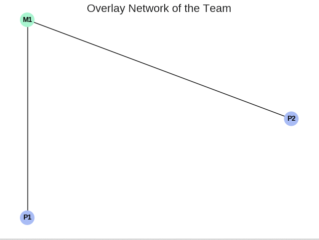
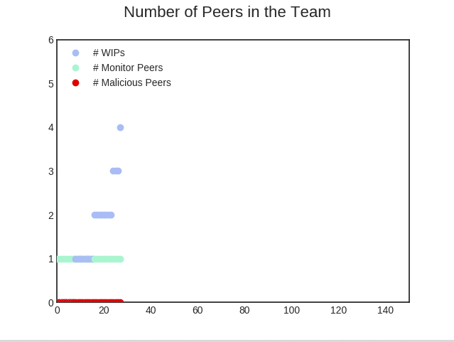
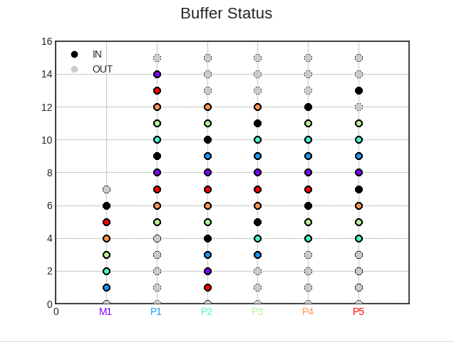

# P2PSP simulator

[](https://gitter.im/P2PSP/Simulator?utm_source=badge&utm_medium=badge&utm_campaign=pr-badge&utm_content=badge)

A complete stand-alone simulator of the P2PSP (Peer-to-Peer Straightforward Protocol) using processes and message passing.

## Examples:

1. Run a team with 10 peers (1 monitor and 9 normal peers), during 100 rounds:
```
# inside of the <src> folder, run:
python3 simulator.py run
```

2. Controlling the number of peers that will join the team:
```
python3 simulator.py run --number_of_peers 20
```

3. Defining the number of rounds to simulate:
```
python3 simulator.py run --number_of_rounds 50
```

4. Seting the maximum number of lost chunks at peers:
```
python3 simulator.py run --max_chunk_loss 50
```

5. Defining the number of monitors:
```
python3 simulator.py run --number_of_monitors 2
```

6. Showing the average CLR:
```
python3 simulator.py run --set_of_rules DBS --number_of_peers 3 --buffer_size 6 --number_of_rounds 100 --max_chunk_loss 1000 --min_activity -100 | grep CLR | awk '{match($0,/CLR=[0-9.]+/);A=substr($0,RSTART,RLENGTH);sub(/.*=/,X,A);print A}' | python ../experiments/average.py
```

6. Using IP multicast instead IP unicast:
```
python3 simulator.py run --set_of_rules IMS
```

7. Setting the logging level (CRITICAL, ERROR, WARNING, INFO, DEBUG):
```
python3 simulator.py run --loglevel INFO
```

8. Showing the buffer of the peer #3 (peers are enumerated sequentially using 3 digits):
```
python3 simulator.py run --loglevel DEBUG | grep "buffer=" | grep "'003'"
```

9. Showing the neighborhood degree of peer #3 for optimization_horizon=5:
```
python3 simulator.py run --loglevel DEBUG --optimization_horizon 5 | grep "fan-out" | grep "'003'"
```

11. Showing the latency (in seconds) of the monitor peer:
```
python3 simulator.py run --loglevel=INFO | grep "'000'" | grep latency | awk '{print $NF}' 
```

12. Showing latency's statistics for all peers:
```
python3 simulator.py run --loglevel=INFO | grep latency | awk '{print $NF}' | gnuplot -e "stats '-'"
```

## Stand-alone nodes

1. Splitter:

2. Peer:

3. Monitor:

## Classes

### Abstract

* splitter_*: splitter's implementation.
* peer_*: peer's implementation.
* monitor_*: monitor's implementation.

* *_DBS: *'s side of DBS.
* *_IMS: modification of DBS to implement IMS.
* *_FCS: modification of DBS to implement FCS.

### Final

* *_simulator: specific simulator behaviour.
* *_video: specific streaming behaviour.

-------------------------------------------------

7. Drawing the simulation
```
python3 play.py draw --drawing-log FILENAME
```
Note: If you want to draw in simulation time, you can add `--gui` option as a flag in the run command.

Example:
```
python play.py draw --drawing-log output_file
```

8. Ploting team and buffer results
Change to <tools> dir and use the <plot> script_
```
cd ../tools
./plot.sh ../src/DRAWING_LOG_FILENAME
```

# Pre-requisites
## Linux
```
$ sudo apt install python3-tk
$ sudo apt-get install gnuplot
$ pip3 install fire
$ pip3 install matplotlib==2.0.0
$ pip3 install networkx
```
### Arch
```
sudo pacman -S python-pmw
```

# Usage

First, go to src dir:
```
$ cd src
```

## Running a simulation
```
$ python3 -u simulator.py run [options]
```
### Options
**--set_of_rules** SET_OF_RULES (currently available: dbs, cis and cis-sss)  
**--number-of-monitors** NUMBER_OF_MONITORS  
**--number-of-peers** NUMBER_OF_PEERS  
**--number-of-malicious** NUMBER_OF_MALICIOUS (optional)  
**--number-of-rounds** NUMBER_OF_ROUNDS  
**--drawing-log** FILENAME  
[**--gui**] (optional)


# Drawing file format
- First line -> experiment configuration:
```
C;[NumberOfMonitor];[NumberOfPeers];[NumberOfMalicious];[NumberOfRounds];[SetOfRules]
```
- Nodes -> `O;Node;[Direction];[NodeID]`. Example: `O;Node;IN;M1`
- Round -> `R;[Number]`
- Team Status -> `T;[NodeID];[Quantity];[RoundNumber]`
- Buffer Status (following lines are related)
  - Buffer -> `B;[NodeID];[C][L][...]. C-> Chunk, L -> Gap`
  - Sender -> `S;[NodeID];[NodeID][...]`
- Chunk Loss Ratio -> `CLR;[NodeID];[Value]`

# GUI

## Network Overlay
It shows how the network overlay evolves during the simulation.


**Nodes** represent the following entities:
- green: monitor/trusted peer (M/TPs)
- blue: regular peer (WIPs)
- red: malicious peer (MPs)

 
**Edges** represent the existence of communication (or not) among the nodes:
- black: there is communication
- red: there is not communication


## Team Status 
It shows the number of each type of peer into the team (same colors as used in Network Overlay).


## Buffer Status
Buffer status for each peer. Each point in the chart represents a chunk in the buffer of a peer:
- black: chunk from the splitter.
- gray: chunk consumed.
- others: chunk from other peers. One different color for each peer.


