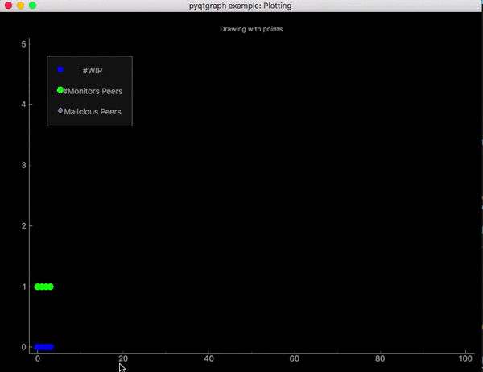
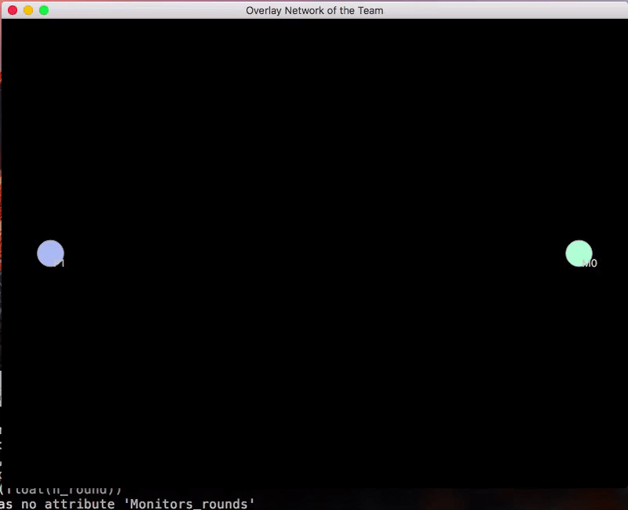
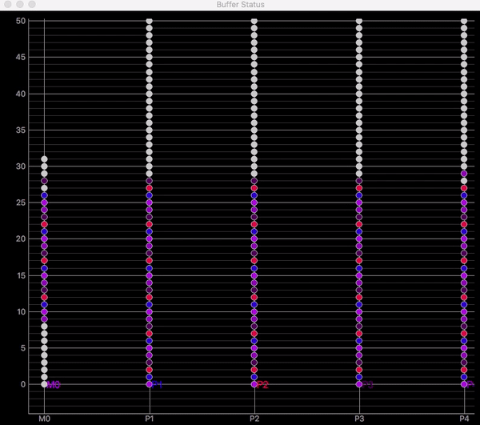

# PyQtGraph-Experiments
The purpose of this repository is to demonstrate plotting alternatives for the [p2psp simulator](https://github.com/P2PSP/simulator/). Since maplotlib is quite slow and sluggish and take quite much time for rendering.
[PyQtGraph](http://www.pyqtgraph.org/) is a very good alternative, as the sole purpose of using PyQtGraph is speed and improving real-time interactivity.
### Requirements
- pyqtgraph
- numpy
- PyQt 4.8+ or PySide
### Installation
 PyQtGraph use pyqt as backend so you would need to install pyqt.
 Visit [http://www.pyqtgraph.org/](http://www.pyqtgraph.org/) for other information.
 ## Results
### Team Status 
 I already have implemented, the whole Team Status plotting method (inside play.py) in pyqtgraph. And results are amazing. Earlier graphs were even not rendering properly on my Macintosh but now it is plotting like butter. 
Execute following command to plot team status.
```sh
$ ./test.me
```


### Network Overlay

It shows how the network overlay evolves during the simulation.

**Nodes** represent the following entities:

- green: monitor/trusted peer (M/TPs)
- blue: regular peer (WIPs)
- red: malicious peer (MPs)



### Buffer status

Buffer status for each peer. Each point in the chart represents a chunk in the buffer of a peer:

- black: chunk from the splitter.
- gray: chunk consumed.
- others: chunk from other peers. One different color for each peer.
 

